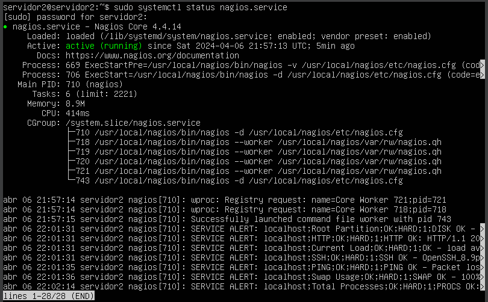

Monitoring Servers with Nagios 
=================

### Authors

| Author          | Origin                               |
| --------------- | ------------------------------------ |
| German Marin    | UniBarranquilla - IUB                |

### Abstract (Resumen)

This series of tasks related to system administration, network monitoring, and containerization. The tasks include setting up and configuring Linux servers, installing monitoring tools such as Nagios and NRPE, deploying services within Docker containers, and configuring host monitoring. Specifically, tasks involve setting up Ubuntu Linux on designated machines (VBOX_NAGIOS and VBOX_DOCKER), installing and configuring Nagios for network monitoring on VBOX_NAGIOS, deploying an NGINX server within a Docker container on VBOX_DOCKER, and configuring host monitoring for at least two services on the Nagios server.

### Screenshots (Pantallazos)

#### VBOX_NAGIOS virtual machine created.

#### Nagios service enabled and active.

#### Nagios dashboard available from a browser.

#### NRPE service enabled and active.

#### Apache and 5666 ports are enabled in firewall.

#### VBOX_DOCKER virtual machine created.

#### Docker service enabled and active.

#### Nginx Container running on Docker.

#### Nginx available from a browser.

#### nagios-nrpe-server service enabled and active.

#### Host defined in configuration file.

#### Services defined in configuration file.

#### The host defined is UP.

#### The Nginx service is UP and another Apache service running on Docker too.

### TOOLS TIC'S (Herramientas TIC'S)

- Docker
- Nagios
- NRPE Plugin
- Nginx
- Apache

### Status

| Status            | Description                          |
| ----------------- | ------------------------------------ |
|  | The study was finished | 

### Keyworks

- `Server`
- `Nagios`
- `Ubuntu`
- `Monitoring`
- `Docker`
- `NRPE`
- `NGINX`
- `Firewall`
- `Configuration`
- `Monitoring`
- `Deployment`
- `Server`
- `Containerization`
- `Service monitoring`

### Roadmap

	 Pre-requisitos (Pre-Requisites)
	 	Install Ubuntu Linux on a machine named VBOX_NAGIOS.
		Install the Nagios monitoring tool on the VBOX_NAGIOS server.
		Enable port 80 in the firewall of the Nagios server.
		Install the NRPE agent service on the VBOX_NAGIOS server.
		Activate port 5666 in the firewall of the Nagios server.
		Install Ubuntu Linux on another machine named VBOX_DOCKER.
		Install Docker on the VBOX_DOCKER machine.
		Deploy an NGINX server within a Docker container on the VBOX_DOCKER machine.
		Install NRPE on the VBOX_DOCKER machine.
		Register hosts and configure monitoring for at least two services on the Nagios serv

	 Installation
		Server (VBOX_NAGIOS)
			Nagios
			NRPE
			NRPE plugins
		Client (VBOX_DOCKER)
			NRPE
			Docker

### Usage

Nagios is crucial for maintaining the health and stability of IT infrastructure through proactive monitoring, alerting, and centralized management. By continuously monitoring servers, networks, applications, and services, Nagios helps detect and address issues before they impact operations, reducing downtime and ensuring smooth performance. Its customizable alerting and notification system ensures that IT teams are promptly informed of any anomalies, enabling them to take corrective action swiftly. With performance monitoring capabilities, Nagios provides valuable insights into system performance trends, aiding in capacity planning and resource optimization. Its scalability, flexibility, and open-source nature make it suitable for organizations of all sizes, while its vibrant community support ensures ongoing innovation and development. Overall, Nagios is an indispensable tool for organizations seeking to maintain the reliability and availability of their IT infrastructure in today's dynamic digital landscape.

### FAQ

#### What is Nagios?
Nagios is an open-source monitoring tool used for monitoring the health and performance of IT infrastructure, including servers, networks, applications, and services.

#### How does Nagios handle alerts?
Nagios provides customizable alerting and notification features to promptly notify IT teams of issues via email, SMS, or other channels, enabling quick response and resolution.

#### What is Docker?
Docker is a containerization platform that allows applications to be packaged with their dependencies into lightweight, portable containers, providing consistency across environments and efficient resource utilization.

#### What are the benefits of using Docker?
Docker simplifies application deployment and management, enhances scalability and portability, and promotes DevOps practices by enabling continuous integration and deployment pipelines.

#### How can Nagios and Docker work together?
Nagios can monitor Docker containers and their associated services, providing insights into container performance, resource usage, and health status, thereby ensuring the reliability and availability of containerized applications.

### Contacts

Email: gmarin@itsa.edu.co

### Acknowledgements

[Nagios Support](https://support.nagios.com/kb/article/nagios-core-installing-nagios-core-from-source-96.html#Ubuntu)

[tecadmin.net](https://tecadmin.net/how-to-install-nagios-nrpe-client-on-ubuntu-22-04/)